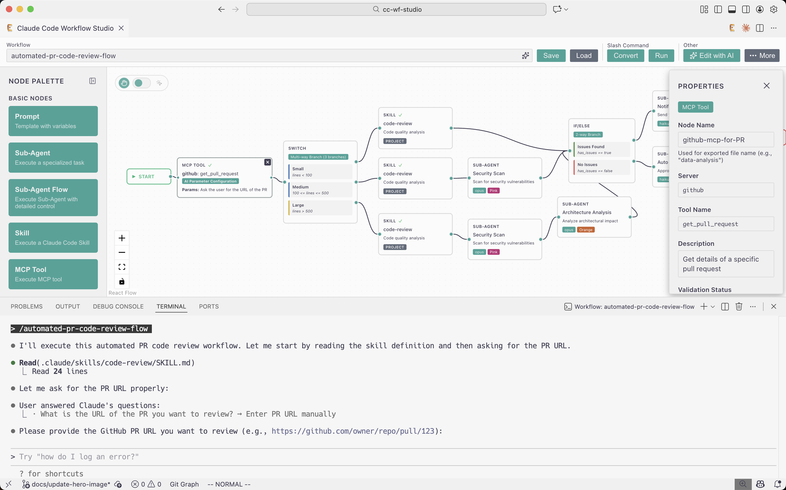

# Claude Code Workflow Studio

<p align="center">
  
</p>

<p align="center">
  <strong>Accelerate Claude Code automation with a visual workflow editor</strong>
</p>

<p align="center">
  Design complex AI agent workflows intuitively with drag-and-drop. Build Sub-Agent orchestrations and conditional branching without writing code, then export directly to <code>.claude</code> format for immediate execution.
</p>

<!-- Hero image placeholder - recommended size: 1600x900px or 16:9 aspect ratio -->
<!-- Place image at: /resources/hero.png -->

## Why Claude Code Workflow Studio?

### 🎯 No-Code Workflow Design
No programming required. Connect Sub-Agent and user decision nodes visually to build sophisticated automation flows.

### ⚡ Ready to Execute
Designed workflows automatically export to `.claude/agents/` and `.claude/commands/`. Use them immediately with Claude Code.

### 🔄 Easy Iteration
Save and load workflows as JSON. Experiment and refine your flows through trial and error.

### 🔒 Fully Offline & Secure
All operations run locally within VSCode. No network communication means zero risk of data leaks or privacy concerns.

## Key Features

✨ **Visual Workflow Editor** - Intuitive drag-and-drop canvas inspired by Dify

🎓 **Interactive Onboarding Tour** - Step-by-step guided tutorial for first-time users, automatically launched on first use with ? button for anytime replay

🤖 **Sub-Agent Nodes** - Configure Claude Code Sub-Agents with custom prompts, tool permissions, and model selection (Sonnet/Opus/Haiku)

❓ **AskUserQuestion Nodes** - Create dynamic conditional branches with 2-4 user-selectable options

💾 **Save & Load** - Persist workflows as JSON files in `.vscode/workflows/`

📤 **One-Click Export** - Generate `.claude/agents/*.md` and `.claude/commands/*.md` files ready for immediate use

🔒 **Safe File Handling** - Automatic conflict detection with confirmation dialogs before overwriting

⚙️ **Intuitive Property Panel** - Configure all node settings in a dedicated right-side panel

🌐 **Multilingual Support** - Both the Visual Editor UI and exported workflows automatically adapt to your VSCode language (English/Japanese/Korean/Simplified Chinese/Traditional Chinese supported)

🤖 **AI-Assisted Workflow Generation** - Generate complete workflows from natural language descriptions using Claude Code CLI integration

📚 **Skill Nodes** - Reference existing Claude Code Skills from personal (`~/.claude/skills/`) or project (`.claude/skills/`) directories, or create new Skills directly from the visual editor

## AI-Assisted Workflow Generation

### Overview

Generate complete workflows automatically by describing them in natural language. The AI interprets your description and creates a fully-configured workflow with nodes and connections ready to use.

### Prerequisites

- **Claude Code CLI** must be installed and accessible in your PATH
- Install from: https://claude.com/claude-code

To verify installation:
```bash
claude --version
```

### How to Use

1. **Open the Editor**
   - Launch Claude Code Workflow Studio

2. **Click "Generate with AI" Button**
   - Located in the main toolbar next to Save/Export buttons

3. **Describe Your Workflow**
   - Write a natural language description (max 2000 characters)
   - Example: "Create a code review workflow that scans code, asks user for priority level, and generates fix suggestions"
   - Example: "Build a data analysis pipeline with file reader, data processor, and report generator"

4. **Generate**
   - Click "Generate" or press `Ctrl+Enter` / `Cmd+Enter`
   - AI processes your description (may take up to 60 seconds)
   - Generated workflow appears on canvas automatically

### Features

- **Smart Positioning**: Generated workflows are placed automatically to avoid overlapping existing nodes
- **Validation**: AI output is validated against schema rules (max 50 nodes, valid connections, etc.)
- **Error Handling**: Clear error messages with actionable guidance if generation fails
- **Multilingual**: All UI elements and error messages support 5 languages (en, ja, ko, zh-CN, zh-TW)

### Tips for Best Results

✅ **Be Specific**: Mention node types (Sub-Agent, AskUserQuestion, etc.) if needed
✅ **Describe Flow**: Explain the sequence and branching logic clearly
✅ **Keep It Simple**: Start with 3-7 nodes, then expand manually if needed

❌ **Avoid**: Overly complex descriptions (20+ nodes may timeout)
❌ **Avoid**: Vague requirements without clear steps

### Example Descriptions

**Simple (3-5 nodes)**
```
Create a workflow that reads a file, processes the content, and saves the result.
```

**Medium (7-10 nodes)**
```
Create a code review workflow:
1. Scan code with a Sub-Agent
2. Ask user to select priority level (Critical/High/Medium)
3. Filter results based on selection
4. Generate fix suggestions with another Sub-Agent
```

**Complex (15-20 nodes)**
```
Build a multi-stage data pipeline:
- Start with data collection from multiple sources
- Run parallel validation checks
- Ask user to approve or reject
- If approved: transform, analyze, and visualize
- If rejected: log reason and end
- Generate final report
```

### Error Messages

| Error Code | Meaning | Solution |
|------------|---------|----------|
| `COMMAND_NOT_FOUND` | Claude Code CLI not installed | Install Claude Code CLI |
| `TIMEOUT` | Request took > 60 seconds | Simplify description or try again |
| `PARSE_ERROR` | AI output couldn't be parsed | Rephrase description and retry |
| `VALIDATION_ERROR` | Workflow exceeds limits (50 nodes max) | Reduce complexity |

### Limitations

- Maximum 50 nodes per generated workflow
- 60-second timeout for AI processing
- Description limited to 2000 characters
- Requires active Claude Code CLI installation

## Getting Started

### Installation

**From VSCode Marketplace** (Coming Soon)

1. Open VSCode Extensions (`Ctrl+Shift+X` / `Cmd+Shift+X`)
2. Search for "Claude Code Workflow Studio"
3. Click **Install**

**From Source**

1. Clone the repository
   ```bash
   git clone https://github.com/breaking-brake/cc-wf-studio.git
   cd cc-wf-studio
   ```
2. Install dependencies
   ```bash
   npm install
   cd src/webview && npm install && cd ../..
   ```
3. Build the extension
   ```bash
   npm run build
   ```
4. Package the extension
   ```bash
   npx vsce package
   ```
5. Install the generated `.vsix` file
   - Open VSCode Extensions (`Ctrl+Shift+X` / `Cmd+Shift+X`)
   - Click the `...` menu → "Install from VSIX..."
   - Select the generated `cc-wf-studio-x.x.x.vsix` file

### Quick Start

**1. Open the Editor**
   - Press `Ctrl+Shift+P` / `Cmd+Shift+P`
   - Type "Claude Code Workflow Studio: Open Editor"
   - Press Enter

**2. Take the Interactive Tour** (First-time users)
   - An interactive onboarding tour will automatically start on your first launch
   - Follow the step-by-step guided tutorial to learn workflow creation hands-on
   - Click the **?** button in the toolbar anytime to restart the tour
   - Available in English, Japanese, Korean, Simplified Chinese, and Traditional Chinese

**3. Create Your Workflow**
   - **Add Nodes**: The left palette is organized into sections:
     - **Basic Nodes**: Prompt (templates), Sub-Agent (AI tasks)
     - **Control Flow**: IfElse (binary branching), Switch (multi-way branching), AskUserQuestion (user decisions)
   - **Configure**: Click a node to edit its properties in the right panel
   - **Connect**: Drag from output ports (right) to input ports (left) to create flow

**4. Save & Export**
   - Enter a workflow name in the toolbar
   - Click **Save** to store as JSON in `.vscode/workflows/`
   - Click **Export** to generate `.claude` files ready for Claude Code

## How It Works

### Prompt Nodes
Define reusable prompt templates with:
- Template variables using `{{variableName}}` syntax
- Dynamic value substitution at runtime
- Variable detection and validation

### Sub-Agent Nodes
Configure autonomous AI agents with:
- Custom system prompts
- Tool permissions (Read, Write, Bash, etc.)
- Model selection (Sonnet for balance, Opus for complex tasks, Haiku for speed)

### Skill Nodes
Integrate Claude Code Skills into your workflows:
- **Personal Skills**: Reference Skills from `~/.claude/skills/` for individual use
- **Project Skills**: Use team-shared Skills from `.claude/skills/` for consistent collaboration
- **Create New Skills**: Build Skills directly from the visual editor with a guided form
- **Browse & Select**: Interactive Skill browser displays available Skills with descriptions and scope indicators
- **Automatic Dependency Tracking**: Exported workflows include documentation of all referenced Skills

Skills are specialized agent capabilities defined in `SKILL.md` files with YAML frontmatter. When a workflow references a Skill, Claude Code automatically invokes it based on the Skill's description trigger.

**Creating a New Skill:**
1. Select a Skill node in your workflow
2. Click "Create New Skill" in the property panel
3. Fill in the Skill details:
   - **Name**: Lowercase, hyphens allowed (e.g., `pdf-analyzer`)
   - **Description**: Brief summary of what the Skill does and when to use it
   - **Instructions**: Full prompt/instructions in markdown format
   - **Allowed Tools**: Optional tool restrictions (Read, Grep, Bash, etc.)
   - **Scope**: Choose Personal (your machine only) or Project (shared with team)
4. The Skill is automatically created and referenced by the node

### Conditional Branching Nodes
Implement conditional logic with specialized nodes:

#### IfElse Node
Fixed 2-way branching for binary conditions:
- True/False, Yes/No, Success/Error patterns
- Simplified configuration for common conditional scenarios
- Clear visual distinction between branches (green/red indicators)

#### Switch Node
Variable multi-way branching (2-N branches):
- Multiple conditional paths from a single decision point
- Dynamic branch management (add/remove cases)
- Ideal for complex routing logic

#### Branch Node (Legacy - Deprecated)
The original Branch node with dual modes is deprecated:
- Still available for backward compatibility
- Marked with deprecation warning in the palette
- **Recommended**: Use IfElse or Switch nodes for new workflows

### AskUserQuestion Nodes
Create decision points where:
- Users choose from 2-4 options (or multiple selections)
- Each option branches to different nodes
- AI can dynamically generate options based on context

### Export Format
Generates ready-to-use files:
- `.claude/agents/*.md` - Sub-Agent definitions
- `.claude/commands/*.md` - SlashCommand to execute the workflow

**Internationalization**: The Visual Editor UI and all exported files automatically adapt to your VSCode display language setting (`vscode.env.language`). Supported languages: English (default), Japanese, Korean, Simplified Chinese (zh-CN), and Traditional Chinese (zh-TW/zh-HK). This ensures both the editing experience and generated workflows are accessible for international teams regardless of their location.

## Usage Examples

### Example 1: Data Analysis Pipeline
1. **Collect Data** Sub-Agent → Gathers data from files
2. **Ask User**: "Choose analysis type" → Statistical / Visual
3. **Statistical Analysis** Sub-Agent OR **Data Visualization** Sub-Agent
4. **Generate Report** Sub-Agent → Creates final output

### Example 2: Code Review Workflow
1. **Code Scanner** Sub-Agent → Identifies issues
2. **Ask User**: "Priority level?" → Critical Only / All Issues
3. **Filter Results** Sub-Agent
4. **Generate Fix Suggestions** Sub-Agent

### Example 3: Document Processing with Skills
1. **Upload Document** Prompt → Asks user for file path
2. **PDF Extractor** Skill (Personal) → Extracts text from PDF files
3. **Ask User**: "Processing type?" → Summarize / Translate / Analyze
4. **Document Processor** Skill (Project) → Team-shared processing logic
5. **Format Results** Sub-Agent → Creates final output

## FAQ

**Q: What is Claude Code?**
A: Claude Code is Anthropic's official CLI tool for building AI-powered workflows. This extension makes it easier to create and manage those workflows visually.

**Q: Do I need programming experience?**
A: No! The visual editor is designed for anyone. Simply drag, drop, and configure nodes through the UI.

**Q: Can I edit exported files manually?**
A: Yes! Exported `.claude` files are plain markdown with frontmatter. Edit them directly if needed.

**Q: What if a workflow file already exists?**
A: The extension will detect conflicts and ask for confirmation before overwriting any files.

**Q: How many nodes can I add?**
A: Up to 50 nodes per workflow. Most workflows use 3-10 nodes.

**Q: What languages are supported?**
A: Both the Visual Editor UI and exported workflows automatically use your VSCode display language setting. Currently supported: English (default), Japanese, Korean, Simplified Chinese (zh-CN), and Traditional Chinese (zh-TW/zh-HK). The extension detects `vscode.env.language` and displays all UI elements and generates documentation in the appropriate language. This includes toolbar buttons, node palette, property panel labels, and all exported files.

**Q: What are Skill nodes?**
A: Skill nodes allow you to integrate Claude Code Skills (specialized agent capabilities) into your workflows. Skills are defined in `SKILL.md` files with YAML frontmatter and can be invoked automatically by Claude based on their description triggers.

**Q: What's the difference between Personal and Project Skills?**
A: Personal Skills are stored in `~/.claude/skills/` and are specific to your machine. Project Skills are stored in `.claude/skills/` within your project directory and can be shared with your team via version control. Use Personal Skills for individual workflows and Project Skills for team collaboration.

**Q: Can I create Skills manually instead of using the visual editor?**
A: Yes! You can create `SKILL.md` files manually in the appropriate directory (`~/.claude/skills/[skill-name]/` or `.claude/skills/[skill-name]/`). The Skill browser will automatically detect them. The visual editor's "Create New Skill" feature is just a convenience.

**Q: What happens if a referenced Skill file is missing?**
A: The visual editor will detect missing Skill files when loading workflows and display a warning indicator on the Skill node. You can then re-select a valid Skill or remove the broken reference.

## Troubleshooting

**Workflow won't save**
- Ensure workflow name contains only letters, numbers, hyphens, and underscores
- Check all required fields are filled
- Look for error messages in VSCode notifications

**Export fails**
- Verify all nodes have valid configurations
- Ensure node names are unique
- Check write permissions for `.claude` directory

**Can't load workflow**
- Click refresh button (↻) to update the list
- Verify file exists in `.vscode/workflows/`
- Check JSON file isn't corrupted

## License

MIT License - see [LICENSE](./LICENSE) file for details

Copyright (c) 2025 breaking-brake

## Acknowledgments

Built with [React Flow](https://reactflow.dev/) • Powered by [Claude Code](https://claude.com/claude-code) • Inspired by [Dify](https://dify.ai/)

---

**Made with Claude Code Workflow Studio**
