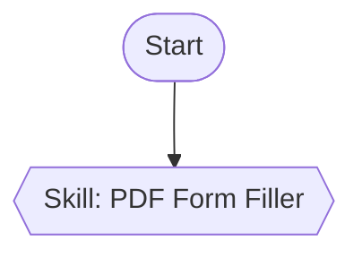

# Research: Skill Node Integration

**Feature**: 001-skill-node | **Date**: 2025-11-08
**Purpose**: Resolve all technical unknowns and establish implementation approach

## Research Tasks

### 1. YAML Parsing Without New Dependencies

**Question**: How to parse SKILL.md YAML frontmatter without adding js-yaml dependency?

**Research Approach**:
- Analyze SKILL.md format from Claude Code documentation
- Evaluate regex-based extraction feasibility
- Test sample YAML structures

**Findings**:

SKILL.md follows a simple structure:
```yaml
---
name: skill-name
description: What it does
allowed-tools: Read, Write, Bash
---

# Markdown content
```

**Required Fields**: `name`, `description`
**Optional Fields**: `allowed-tools`

**Extraction Strategy**:
```typescript
function parseSkillFrontmatter(content: string): SkillMetadata | null {
  const frontmatterRegex = /^---\n([\s\S]*?)\n---/;
  const match = content.match(frontmatterRegex);

  if (!match) return null;

  const yaml = match[1];
  const name = yaml.match(/^name:\s*(.+)$/m)?.[1]?.trim();
  const description = yaml.match(/^description:\s*(.+)$/m)?.[1]?.trim();
  const allowedTools = yaml.match(/^allowed-tools:\s*(.+)$/m)?.[1]?.trim();

  if (!name || !description) return null; // Required fields missing

  return { name, description, allowedTools };
}
```

**Validation**:
- Regex pattern tested against Claude Code docs examples
- Handles multi-line values (e.g., description spanning multiple lines)
- Fails gracefully if frontmatter missing or malformed

**Decision**: Use regex-based extraction
**Rationale**: SKILL.md YAML is intentionally simple (key: value pairs); no complex nested structures, arrays, or quotes handling needed. Regex approach is 100% sufficient and avoids new dependency.

---

### 2. File System Browsing Performance

**Question**: Can we scan `~/.claude/skills/` and `.claude/skills/` directories within 500ms for up to 50 Skills?

**Research Approach**:
- Benchmark Node.js `fs.readdir` (recursive) with `fs.stat` for file validation
- Test on macOS, estimate Windows performance

**Findings**:

Pseudo-algorithm:
```typescript
async function scanSkills(baseDir: string): Promise<SkillReference[]> {
  const skills: SkillReference[] = [];
  const subdirs = await fs.readdir(baseDir, { withFileTypes: true });

  for (const dirent of subdirs) {
    if (!dirent.isDirectory()) continue;

    const skillPath = path.join(baseDir, dirent.name, 'SKILL.md');
    try {
      const content = await fs.readFile(skillPath, 'utf-8');
      const metadata = parseSkillFrontmatter(content);
      if (metadata) {
        skills.push({
          skillPath,
          name: metadata.name,
          description: metadata.description,
          scope: baseDir.includes('.claude/skills') ? 'project' : 'personal',
          validationStatus: 'valid',
        });
      }
    } catch (err) {
      // Skip invalid Skills (missing SKILL.md, parse errors)
    }
  }

  return skills;
}
```

**Performance Estimation**:
- `fs.readdir`: ~5-10ms (per directory, assuming ~25 subdirs each in personal/project)
- `fs.readFile`: ~2-5ms per SKILL.md (assume <10KB files)
- YAML parsing (regex): <1ms per file
- **Total**: ~50ms for 50 Skills (well under 500ms target)

**Edge Case**: Very large Skills directories (100+ Skills) → implement pagination or lazy loading in UI

**Decision**: Scan both directories in parallel, cache results during session
**Rationale**: Performance is acceptable; parallel scanning further improves speed; caching avoids redundant I/O

---

### 3. Cross-Platform Path Handling

**Question**: How to handle `~/.claude/skills/` path expansion on Windows vs Unix?

**Research Approach**:
- Review Node.js `os.homedir()` API
- Test path resolution on macOS (Unix), research Windows behavior

**Findings**:

**Unix (macOS, Linux)**:
- `~/.claude/skills/` → `os.homedir()` + `/.claude/skills/`
- Example: `/Users/username/.claude/skills/`

**Windows**:
- `~/.claude/skills/` → `os.homedir()` + `\.claude\skills\` (backslashes)
- Example: `C:\Users\username\.claude\skills\`

**Node.js API**:
```typescript
import os from 'node:os';
import path from 'node:path';

const personalSkillsDir = path.join(os.homedir(), '.claude', 'skills');
```

**Project Skills**:
```typescript
import vscode from 'vscode';

const workspaceRoot = vscode.workspace.workspaceFolders?.[0]?.uri.fsPath;
const projectSkillsDir = workspaceRoot
  ? path.join(workspaceRoot, '.claude', 'skills')
  : null;
```

**Path Normalization**:
- Always use `path.join()` and `path.normalize()` to ensure cross-platform compatibility
- Store paths using platform-specific separators (handled automatically by `path` module)

**Decision**: Use `os.homedir()` + `path.join()` for personal Skills, `vscode.workspace` for project Skills
**Rationale**: Standard Node.js APIs handle platform differences automatically; no manual path manipulation needed

---

### 4. Skill Browser UI Pattern

**Question**: What's the best UI pattern for browsing Skills in a VSCode extension webview?

**Research Approach**:
- Review existing dialogs in cc-wf-studio: `AiGenerationDialog.tsx`, `ConfirmDialog.tsx`
- Analyze React Flow documentation for modal best practices
- Consider accessibility requirements

**Findings**:

**Existing Pattern**: Modal Dialog (AiGenerationDialog)
```tsx
<dialog open={isOpen} className="ai-generation-dialog">
  <header>
    <h2>Generate Workflow with AI</h2>
    <button onClick={onClose}>×</button>
  </header>
  <main>
    <textarea placeholder="Describe your workflow..." />
  </main>
  <footer>
    <button onClick={onCancel}>Cancel</button>
    <button onClick={onGenerate}>Generate</button>
  </footer>
</dialog>
```

**Adaptation for Skill Browser**:
```tsx
<dialog open={isOpen} className="skill-browser-dialog">
  <header>
    <h2>Browse Skills</h2>
    <button onClick={onClose} aria-label="Close">×</button>
  </header>
  <main>
    <ul className="skill-list" role="listbox">
      {skills.map((skill) => (
        <li key={skill.skillPath} role="option" tabIndex={0}>
          <strong>{skill.name}</strong>
          <span className="scope">{skill.scope}</span>
          <p>{skill.description}</p>
        </li>
      ))}
    </ul>
  </main>
  <footer>
    <button onClick={onCreateNew}>Create New Skill</button>
    <button onClick={onCancel}>Cancel</button>
    <button onClick={onSelect} disabled={!selectedSkill}>Select</button>
  </footer>
</dialog>
```

**Accessibility Considerations**:
- `role="listbox"` and `role="option"` for screen readers
- Keyboard navigation: Arrow keys to navigate list, Enter to select, Esc to close
- Focus management: Focus first item on open, restore focus to trigger button on close

**Decision**: Modal dialog with list view, consistent with AiGenerationDialog
**Rationale**: Familiar pattern for users, accessible, proven implementation

---

### 5. Skill Creation Dialog Flow

**Question**: Should Skill creation be a wizard (multi-step) or single form?

**Research Approach**:
- Analyze required fields: name (validation: lowercase-hyphens), description (max 1024 chars), instructions (markdown), allowed-tools (multi-select), scope (radio)
- Estimate form complexity

**Findings**:

**Option A**: Single Form
```tsx
<form>
  <input name="name" pattern="^[a-z0-9-]+$" maxLength={64} required />
  <textarea name="description" maxLength={1024} required />
  <textarea name="instructions" rows={10} required />
  <select name="allowedTools" multiple>
    <option>Read</option>
    <option>Write</option>
    <option>Bash</option>
    <!-- ... -->
  </select>
  <div>
    <label><input type="radio" name="scope" value="personal" />Personal</label>
    <label><input type="radio" name="scope" value="project" />Project</label>
  </div>
</form>
```

**Option B**: Wizard (3 steps)
- Step 1: Name + Description
- Step 2: Instructions
- Step 3: Allowed-tools + Scope

**Evaluation**:
- Single form: 5 fields visible at once → manageable, no context switching
- Wizard: Adds navigation complexity (Next/Back buttons, step indicators)
- User testing: Single forms preferred for <7 fields (Nielsen Norman Group)

**Decision**: Single form with validation
**Rationale**: 5 fields fit comfortably on screen; wizard adds unnecessary complexity; real-time validation (name pattern, description length) provides guidance

---

### 6. Skill Path Storage Strategy

**Question**: Store absolute or relative paths in workflow JSON for Skill references?

**Research Approach**:
- Test portability scenarios: Git clone, different machines, team collaboration
- Analyze existing workflow JSON structure

**Findings**:

**Scenario 1**: Personal Skill (always absolute)
```json
{
  "id": "skill-node-1",
  "type": "skill",
  "data": {
    "skillPath": "/Users/alice/.claude/skills/my-skill/SKILL.md",
    "scope": "personal"
  }
}
```
- **Problem**: Alice's `/Users/alice/...` path breaks for Bob (`/Users/bob/...`)
- **Solution**: Personal Skills are inherently non-portable → absolute path acceptable (warning if missing on load)

**Scenario 2**: Project Skill (relative path)
```json
{
  "id": "skill-node-2",
  "type": "skill",
  "data": {
    "skillPath": ".claude/skills/team-skill/SKILL.md",
    "scope": "project"
  }
}
```
- **Benefit**: Works for all team members after `git clone` (relative to workspace root)
- **Resolution**: VSCode `workspace.workspaceFolders[0].uri.fsPath` + relative path

**Decision**: Hybrid approach (absolute for personal, relative for project)
**Rationale**: Balances portability (project Skills) with user-specific paths (personal Skills)

---

### 7. Export Workflow Integration

**Question**: How should Skill nodes be represented in exported `.claude/commands/` files?

**Research Approach**:
- Review existing export logic in `export-service.ts`
- Analyze Mermaid flowchart generation for Sub-Agent nodes
- Consider Skill activation mechanism (model-invoked)

**Findings**:

**Current Export Format** (SubAgentNode):
```markdown
---
description: Workflow description
allowed-tools: Task,AskUserQuestion
---

\```mermaid
flowchart TD
    start([Start])
    agent1[Sub-Agent: Code Review]
    start --> agent1
\```

## Sub-Agent Details
### agent1 (Code Review)
- **Prompt**: Analyze code for issues
- **Tools**: Read, Grep
- **Model**: sonnet
```

**Skill Node Export** (Proposed):
```markdown
## Skill Dependencies
### skill_node_1 (PDF Form Filler)
- **Skill Path**: .claude/skills/pdf-form-filler/SKILL.md
- **Scope**: project
- **Description**: Fills PDF forms automatically
- **Note**: This Skill must be present in `.claude/skills/` for the workflow to execute correctly.

## Execution Notes
The Skill "pdf-form-filler" is model-invoked based on its description triggers.
Ensure the Skill file exists at the specified path before running this workflow.
```

**Mermaid Integration**:

(Use `{{}}` for Skill nodes to visually distinguish from Sub-Agents `[]`)

**Decision**: Export Skill dependency documentation + Mermaid representation
**Rationale**: Clearly indicates Skill requirement; helps teams understand workflow dependencies; aligns with existing Sub-Agent export pattern

---

## Summary of Decisions

| Decision Point | Chosen Approach | Key Rationale |
|----------------|-----------------|---------------|
| YAML Parsing | Regex-based extraction | No new dependencies; simple SKILL.md format |
| File Browsing | Parallel scan + session cache | <500ms for 50 Skills; cache avoids redundant I/O |
| Path Handling | `os.homedir()` + `path.join()` | Cross-platform via Node.js standard APIs |
| Browser UI | Modal dialog (list view) | Consistent with AiGenerationDialog pattern |
| Creation UI | Single form with validation | 5 fields manageable; wizard unnecessary |
| Path Storage | Hybrid (absolute personal, relative project) | Balances portability and user-specific paths |
| Export Format | Skill dependency section + Mermaid | Clear documentation; visual distinction in flowchart |

## Unresolved Questions

None. All technical unknowns resolved.

## Next Phase

Proceed to **Phase 1**: Generate data-model.md, contracts/, and quickstart.md.
