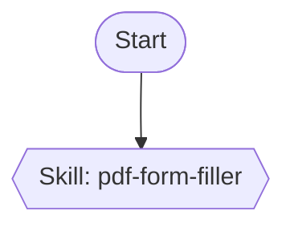
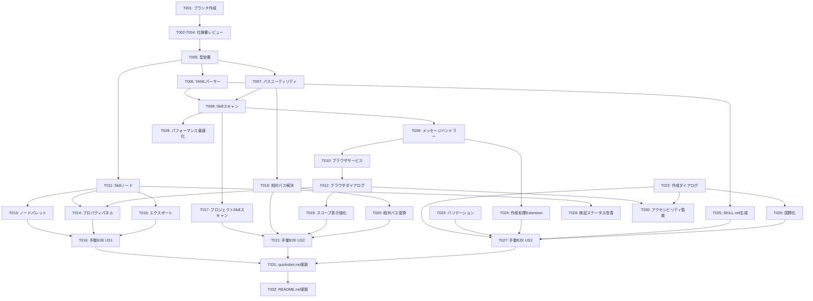

# 実装タスク: Skill Node Integration

**Feature**: 001-skill-node | **Generated**: 2025-11-08 | **Status**: Completed (Phase 5)

このドキュメントは、Skill Node機能の実装タスクを定義します。各フェーズ完了時にユーザーによる手動E2Eテストを実施します。

---

## 進捗管理

**チェックリストの使い方**:
- `- [ ]` : 未着手タスク
- `- [x]` : 完了済みタスク

**タスクID形式**: `[T番号] [P優先度] [Story関連ストーリー] タスク概要 (ファイルパス)`
- 優先度: P1(最重要) → P2(重要) → P3(通常)
- Story: US1(個人Skill参照), US2(プロジェクトSkill参照), US3(新規Skill作成)

**実装フロー**:
1. Phase 1: セットアップ → 基盤整備
2. Phase 2: 基礎機能(ブロッキング) → MVP必須
3. Phase 3: US1実装 → 個人Skill参照機能[MVP]
4. Phase 4: US2実装 → プロジェクトSkill参照機能
5. Phase 5: US3実装 → Skill新規作成機能
6. Phase 6: 仕上げ → 横断的改善

---

## Phase 1: セットアップ (Setup)

**目標**: プロジェクト環境の準備とドキュメント整備

### タスク一覧

- [x] [T001] [P1] [Setup] 機能ブランチ001-skill-nodeの作成と初期コミット
- [x] [T002] [P1] [Setup] 仕様書(spec.md)の最終レビューと承認
- [x] [T003] [P1] [Setup] データモデル(data-model.md)の最終レビューと承認
- [x] [T004] [P1] [Setup] メッセージ契約(contracts/skill-messages.ts)の最終レビューと承認

### 詳細

#### T001: 機能ブランチ作成

**目的**: 機能開発用のGitブランチを作成し、仕様書をコミット

**前提条件**:
- mainブランチがクリーンな状態
- 仕様書ファイルが`specs/001-skill-node/`に存在

**手順**:
```bash
git checkout -b 001-skill-node
git add specs/001-skill-node/
git commit -m "feat: add Skill node specification"
```

**完了条件**:
- [x] ブランチ001-skill-nodeが作成されている
- [x] spec.md, plan.md, data-model.md, contracts/がコミットされている

---

#### T002-T004: 仕様書レビュー

**目的**: 各設計ドキュメントの内容を最終確認し、実装方針を固める

**レビュー観点**:
- データモデルの整合性(SkillNodeData, SkillReference, SkillMetadataの関係)
- メッセージ契約の完全性(全11メッセージタイプが定義されているか)
- エラーハンドリング戦略(エラーコードと国際化対応)

**完了条件**:
- [x] 各ドキュメントに矛盾がない
- [x] チーム/レビュアーの承認を得ている

---

## Phase 2: 基礎機能 (Foundational)

**目標**: 全ユーザーストーリーが依存する共通機能の実装

### タスク一覧

- [x] [T005] [P1] [Foundation] TypeScript型定義の追加 (src/shared/types/workflow-definition.ts, messages.ts)
- [x] [T006] [P1] [Foundation] YAMLパーサーの実装 (src/extension/services/yaml-parser.ts)
- [x] [T007] [P1] [Foundation] クロスプラットフォームパスユーティリティの実装 (src/extension/utils/path-utils.ts)
- [x] [T008] [P1] [Foundation] Skillサービスのスキャン機能実装 (src/extension/services/skill-service.ts)

### 詳細

#### T005: TypeScript型定義の追加

**目的**: SkillノードとSkill関連メッセージの型を定義し、型安全性を確保

**実装内容**:
```typescript
// src/shared/types/workflow-definition.ts
enum NodeType {
  Skill = 'skill' // 新規追加
}

interface SkillNodeData {
  name: string;
  description: string;
  skillPath: string;
  scope: 'personal' | 'project';
  allowedTools?: string;
  validationStatus: 'valid' | 'missing' | 'invalid';
  outputPorts: 1;
}

interface SkillNode extends BaseNode {
  type: NodeType.Skill;
  data: SkillNodeData;
}

type WorkflowNode = SubAgentNode | ... | SkillNode;
```

```typescript
// src/shared/types/messages.ts
interface SkillReference { /* data-model.mdの通り */ }
interface CreateSkillPayload { /* data-model.mdの通り */ }
// ... 全11メッセージタイプ
```

**実装ファイル**:
- `src/shared/types/workflow-definition.ts` (UPDATE)
- `src/shared/types/messages.ts` (UPDATE)

**完了条件**:
- [x] `NodeType.Skill`が追加されている
- [x] `SkillNodeData`, `SkillNode`インターフェースが定義されている
- [x] 11個のメッセージタイプがすべて定義されている
- [x] TypeScriptコンパイルエラーなし

**依存関係**: なし(Phase 2の最初のタスク)

---

#### T006: YAMLパーサーの実装

**目的**: SKILL.mdのYAML frontmatterを解析し、メタデータを抽出

**実装内容**:
```typescript
// src/extension/services/yaml-parser.ts
export interface SkillMetadata {
  name: string;
  description: string;
  allowedTools?: string;
}

export function parseSkillFrontmatter(content: string): SkillMetadata | null {
  // research.mdのアルゴリズムを実装
  const frontmatterRegex = /^---\n([\s\S]*?)\n---/;
  const match = content.match(frontmatterRegex);

  if (!match) return null;

  const yaml = match[1];
  const name = yaml.match(/^name:\s*(.+)$/m)?.[1]?.trim();
  const description = yaml.match(/^description:\s*(.+)$/m)?.[1]?.trim();
  const allowedTools = yaml.match(/^allowed-tools:\s*(.+)$/m)?.[1]?.trim();

  if (!name || !description) return null;

  return { name, description, allowedTools };
}
```

**実装ファイル**:
- `src/extension/services/yaml-parser.ts` (NEW)

**完了条件**:
- [x] `parseSkillFrontmatter`関数が実装されている
- [x] 必須フィールド(name, description)の抽出が動作
- [x] オプションフィールド(allowed-tools)の抽出が動作
- [x] 無効なYAMLで`null`を返す

**依存関係**: T005(型定義)

**参考**: `specs/001-skill-node/research.md` セクション1

---

#### T007: クロスプラットフォームパスユーティリティ

**目的**: Windows/Unix環境でSkillディレクトリパスを正しく解決

**実装内容**:
```typescript
// src/extension/utils/path-utils.ts
import os from 'node:os';
import path from 'node:path';
import vscode from 'vscode';

export function getPersonalSkillsDir(): string {
  return path.join(os.homedir(), '.claude', 'skills');
}

export function getProjectSkillsDir(): string | null {
  const workspaceRoot = vscode.workspace.workspaceFolders?.[0]?.uri.fsPath;
  if (!workspaceRoot) return null;
  return path.join(workspaceRoot, '.claude', 'skills');
}

export function resolveSkillPath(skillPath: string, scope: 'personal' | 'project'): string {
  if (scope === 'personal') {
    return skillPath; // 既に絶対パス
  }
  // プロジェクトSkillは相対パスを絶対パスに変換
  const projectDir = getProjectSkillsDir();
  if (!projectDir) throw new Error('No workspace folder');
  return path.resolve(projectDir, skillPath);
}
```

**実装ファイル**:
- `src/extension/utils/path-utils.ts` (NEW)

**完了条件**:
- [x] `getPersonalSkillsDir()`が正しいパスを返す
- [x] `getProjectSkillsDir()`がワークスペースルートを基準にパスを返す
- [x] `resolveSkillPath()`が絶対/相対パスを正しく解決
- [x] Windows/Unixパスセパレータが自動処理される

**依存関係**: なし

**参考**: `specs/001-skill-node/research.md` セクション3

---

#### T008: Skillサービスのスキャン機能

**目的**: ~/.claude/skills/と.claude/skills/からSkill一覧を取得

**実装内容**:
```typescript
// src/extension/services/skill-service.ts
import fs from 'node:fs/promises';
import path from 'node:path';
import { parseSkillFrontmatter, SkillMetadata } from './yaml-parser';
import { getPersonalSkillsDir, getProjectSkillsDir } from '../utils/path-utils';

export async function scanSkills(baseDir: string, scope: 'personal' | 'project'): Promise<SkillReference[]> {
  const skills: SkillReference[] = [];

  try {
    const subdirs = await fs.readdir(baseDir, { withFileTypes: true });

    for (const dirent of subdirs) {
      if (!dirent.isDirectory()) continue;

      const skillPath = path.join(baseDir, dirent.name, 'SKILL.md');
      try {
        const content = await fs.readFile(skillPath, 'utf-8');
        const metadata = parseSkillFrontmatter(content);

        if (metadata) {
          skills.push({
            skillPath,
            name: metadata.name,
            description: metadata.description,
            scope,
            validationStatus: 'valid',
            allowedTools: metadata.allowedTools,
          });
        }
      } catch (err) {
        // Skip invalid Skills
        console.warn(`Failed to parse ${skillPath}:`, err);
      }
    }
  } catch (err) {
    // ディレクトリが存在しない場合は空配列を返す
    console.warn(`Skill directory not found: ${baseDir}`);
  }

  return skills;
}

export async function createSkill(payload: CreateSkillPayload): Promise<string> {
  // Phase 5で実装
  throw new Error('Not implemented');
}

export async function validateSkillFile(skillPath: string): Promise<SkillMetadata> {
  const content = await fs.readFile(skillPath, 'utf-8');
  const metadata = parseSkillFrontmatter(content);
  if (!metadata) {
    throw new Error('Invalid SKILL.md frontmatter');
  }
  return metadata;
}
```

**実装ファイル**:
- `src/extension/services/skill-service.ts` (NEW)

**完了条件**:
- [x] `scanSkills()`が有効なSkillを返す
- [x] 無効なSkillはスキップされログ出力される
- [x] ディレクトリが存在しない場合は空配列を返す

**依存関係**: T006(YAMLパーサー), T007(パスユーティリティ)

**参考**: `specs/001-skill-node/research.md` セクション2

---

## Phase 3: User Story 1 - 個人Skill参照機能 [MVP]

**目標**: ユーザーが既存の個人Skillをワークフローに組み込める(US1)

**優先度**: P1(MVP必須機能)

### タスク一覧

- [x] [T009] [P1] [US1] Extension側メッセージハンドラーの実装 (src/extension/commands/skill-operations.ts)
- [x] [T010] [P1] [US1] Webview側Skillブラウザサービスの実装 (src/webview/src/services/skill-browser-service.ts)
- [x] [T011] [P1] [US1] SkillノードReactコンポーネントの実装 (src/webview/src/components/nodes/SkillNode.tsx)
- [x] [T012] [P1] [US1] Skillブラウザダイアログの実装 (src/webview/src/components/dialogs/SkillBrowserDialog.tsx)
- [x] [T013] [P1] [US1] ノードパレットへのSkillノード追加 (src/webview/src/components/NodePalette.tsx)
- [x] [T014] [P1] [US1] プロパティパネルのSkillノード対応 (src/webview/src/components/PropertyPanel.tsx)
- [x] [T015] [P1] [US1] ワークフローエクスポート時のSkill依存関係ドキュメント生成 (src/extension/services/export-service.ts)
- [x] [T016] [P1] [US1] 手動E2Eテスト: Skillノード追加からエクスポートまで

### 詳細

#### T009: Extension側メッセージハンドラー

**目的**: WebviewからのSkill操作リクエストを処理

**実装内容**:
```typescript
// src/extension/commands/skill-operations.ts
import * as vscode from 'vscode';
import { scanSkills } from '../services/skill-service';
import { getPersonalSkillsDir, getProjectSkillsDir } from '../utils/path-utils';

export async function handleBrowseSkills(
  webview: vscode.Webview,
  requestId: string
): Promise<void> {
  try {
    const personalDir = getPersonalSkillsDir();
    const projectDir = getProjectSkillsDir();

    const [personalSkills, projectSkills] = await Promise.all([
      scanSkills(personalDir, 'personal'),
      projectDir ? scanSkills(projectDir, 'project') : Promise.resolve([]),
    ]);

    const allSkills = [...personalSkills, ...projectSkills];

    webview.postMessage({
      type: 'SKILL_LIST_LOADED',
      requestId,
      payload: {
        skills: allSkills,
        timestamp: new Date().toISOString(),
        personalCount: personalSkills.length,
        projectCount: projectSkills.length,
      },
    });
  } catch (error) {
    webview.postMessage({
      type: 'SKILL_VALIDATION_FAILED',
      requestId,
      payload: {
        errorCode: 'UNKNOWN_ERROR',
        errorMessage: String(error),
      },
    });
  }
}

export async function handleCreateSkill(/* Phase 5で実装 */) {}
export async function handleValidateSkillFile(/* 必要に応じて実装 */) {}
```

**実装ファイル**:
- `src/extension/commands/skill-operations.ts` (NEW)

**完了条件**:
- [x] `handleBrowseSkills`が実装されている
- [x] personalとprojectを並列スキャンしている
- [x] エラー時に適切なエラーメッセージを返す
- [x] VSCode Output Channelにログ出力される

**依存関係**: T008(Skillサービス)

---

#### T010: Webview側Skillブラウザサービス

**目的**: Webview UIからExtensionにSkill操作をリクエスト

**実装内容**:
```typescript
// src/webview/src/services/skill-browser-service.ts
export async function browseSkills(): Promise<SkillReference[]> {
  return new Promise((resolve, reject) => {
    const requestId = `browse-${Date.now()}`;

    const handler = (event: MessageEvent) => {
      const message = event.data;
      if (message.requestId !== requestId) return;

      if (message.type === 'SKILL_LIST_LOADED') {
        window.removeEventListener('message', handler);
        resolve(message.payload.skills);
      } else if (message.type === 'SKILL_VALIDATION_FAILED') {
        window.removeEventListener('message', handler);
        reject(new Error(message.payload.errorMessage));
      }
    };

    window.addEventListener('message', handler);

    vscode.postMessage({
      type: 'BROWSE_SKILLS',
      requestId,
    });

    // タイムアウト処理
    setTimeout(() => {
      window.removeEventListener('message', handler);
      reject(new Error('Request timeout'));
    }, 10000);
  });
}
```

**実装ファイル**:
- `src/webview/src/services/skill-browser-service.ts` (NEW)

**完了条件**:
- [x] `browseSkills()`が実装されている
- [x] タイムアウト処理が動作する
- [x] エラー時に適切なエラーメッセージを返す

**依存関係**: T009(メッセージハンドラー)

---

#### T011: SkillノードReactコンポーネント

**目的**: キャンバス上にSkillノードを表示・編集可能にする

**実装内容**:
- ノードラベル(Skill名)
- スコープバッジ(Personal/Project)
- 検証ステータスアイコン(valid/missing/invalid)
- 入出力ポート(各1つ)

**実装ファイル**:
- `src/webview/src/components/nodes/SkillNode.tsx` (NEW)
- `src/webview/src/components/nodes/SkillNode.module.css` (NEW)

**完了条件**:
- [x] SkillNodeがキャンバスに表示される
- [x] 検証ステータスに応じたアイコン表示
- [x] クリック時にプロパティパネルが開く

**依存関係**: T005(型定義)

---

#### T012: Skillブラウザダイアログ

**目的**: 既存Skillの一覧を表示し選択可能にする

**実装内容**:
- Skill一覧リスト(名前、説明、スコープ表示)
- 検索フィルター(名前で絞り込み)
- 選択ボタン、キャンセルボタン
- キーボードナビゲーション(矢印キー、Enter、Esc)

**実装ファイル**:
- `src/webview/src/components/dialogs/SkillBrowserDialog.tsx` (NEW)
- `src/webview/src/components/dialogs/SkillBrowserDialog.module.css` (NEW)

**完了条件**:
- [x] ダイアログが開き、Skill一覧が表示される
- [x] Skill選択後、ダイアログが閉じる
- [x] キーボードナビゲーションが動作
- [x] 国際化対応(5言語: en, ja, ko, zh-CN, zh-TW)

**依存関係**: T010(ブラウザサービス), T011(Skillノード)

**参考**: `specs/001-skill-node/research.md` セクション4

---

#### T013: ノードパレットへの追加

**目的**: ユーザーがSkillノードをドラッグ&ドロップできるようにする

**実装内容**:
- ノードパレットに"Skill"アイテムを追加
- ドラッグ開始時にSkillNodeデータを生成
- キャンバスにドロップ時にノードを作成

**実装ファイル**:
- `src/webview/src/components/NodePalette.tsx` (UPDATE)

**完了条件**:
- [x] ノードパレットに"Skill"が表示される
- [x] ドラッグ&ドロップでキャンバスに追加できる

**依存関係**: T011(Skillノード)

---

#### T014: プロパティパネルのSkillノード対応

**目的**: Skillノード選択時にプロパティを表示・編集可能にする

**実装内容**:
- Skill名(読み取り専用)
- Skill説明(読み取り専用)
- ファイルパス(読み取り専用)
- スコープバッジ(Personal/Project)
- "Browse Skills"ボタン(再選択)
- 検証ステータス警告(missing/invalidの場合)

**実装ファイル**:
- `src/webview/src/components/PropertyPanel.tsx` (UPDATE)

**完了条件**:
- [x] Skillノード選択時にプロパティが表示される
- [x] "Browse Skills"ボタンでブラウザダイアログが開く
- [x] 検証ステータス警告が適切に表示される

**依存関係**: T011(Skillノード), T012(ブラウザダイアログ)

---

#### T015: ワークフローエクスポート時のSkill依存関係ドキュメント

**目的**: エクスポート時にSkill依存関係を.claude/commands/に記載

**実装内容**:
```markdown
## Skill Dependencies

### skill_node_1 (pdf-form-filler)
- **Skill Path**: .claude/skills/pdf-form-filler/SKILL.md
- **Scope**: project
- **Description**: Fills PDF forms automatically
- **Note**: This Skill must be present in `.claude/skills/` for the workflow to execute correctly.
```



**実装ファイル**:
- `src/extension/services/export-service.ts` (UPDATE)

**完了条件**:
- [x] Skillノードを含むワークフローのエクスポートが成功
- [x] エクスポートファイルにSkill依存関係セクションが含まれる
- [x] Mermaidフローチャートで`[[]]`が使用されている

**依存関係**: T011(Skillノード)

**参考**: `specs/001-skill-node/research.md` セクション7

---

#### T016: 手動E2Eテスト(US1完了確認)

**目的**: US1の受け入れ基準が全て満たされていることを確認

**テストシナリオ**:
1. **Skillノードの追加**:
   - VSCode拡張を起動
   - ワークフローエディタを開く
   - ノードパレットから"Skill"ノードをキャンバスにドラッグ
   - ✅ Skillノードが表示される

2. **既存Skillの参照**:
   - Skillノードを選択
   - プロパティパネルの"Browse Skills"ボタンをクリック
   - ブラウザダイアログが開く
   - ~/.claude/skills/にあるSkillが一覧表示される
   - Skillを選択して"Select"ボタンをクリック
   - ✅ ノードラベルがSkill名に更新される

3. **ワークフローの保存とエクスポート**:
   - ワークフロー名を入力
   - "Export"ボタンをクリック
   - .claude/commands/[workflow-name].mdが生成される
   - ✅ ファイルにSkill依存関係セクションが含まれる

4. **エクスポートされたSlashCommandの実行**:
   - Claude Codeで`/[workflow-name]`を実行
   - ✅ 参照されたSkillが正しく動作する

**完了条件**:
- [x] US1の全4つの受け入れシナリオが手動テストで確認済み
- [x] テスト結果を確認済み（Skillノード追加、選択、プロパティ表示、エクスポート全て動作）

**依存関係**: T009-T015(すべてのUS1タスク)

---

## Phase 4: User Story 2 - プロジェクトSkill参照機能

**目標**: チーム共有のプロジェクトSkillをワークフローに組み込める(US2)

**優先度**: P2(チームコラボレーション機能)

### タスク一覧

- [x] [T017] [P2] [US2] プロジェクトSkillスキャン機能の強化 (src/extension/services/skill-service.ts)
- [x] [T018] [P2] [US2] 相対パス解決ロジックの実装 (src/extension/utils/path-utils.ts)
- [x] [T019] [P2] [US2] Skillブラウザダイアログでのスコープ表示強化 (src/webview/src/components/dialogs/SkillBrowserDialog.tsx)
- [x] [T020] [P2] [US2] ワークフロー保存時の相対パス変換 (src/extension/services/skill-service.ts)
- [x] [T021] [P2] [US2] 手動E2Eテスト: プロジェクトSkill参照の動作確認

### 詳細

#### T017: プロジェクトSkillスキャン強化

**目的**: .claude/skills/ディレクトリからプロジェクトSkillを検出

**実装内容**:
- T008のscanSkills関数を拡張し、プロジェクトSkillsもスキャン
- personal/projectスキャンを並列実行

**完了条件**:
- [x] プロジェクトSkillsが正しくスキャンされる
- [x] スコープ='project'が設定される

**依存関係**: T008(Skillサービス基礎)

---

#### T018: 相対パス解決ロジック

**目的**: プロジェクトSkillの相対パスを絶対パスに解決

**実装内容**:
- `resolveSkillPath()`でワークスペースルートを基準に解決
- エラーハンドリング(ワークスペースがない場合)

**完了条件**:
- [x] 相対パスが正しく絶対パスに変換される
- [x] ワークスペースがない場合はnullを返す

**依存関係**: T007(パスユーティリティ基礎)

---

#### T019: スコープ表示強化

**目的**: ブラウザダイアログでPersonal/Projectを明確に区別

**実装内容**:
- 各Skillに"Personal"/"Project"バッジを表示
- バッジスタイリング、アイコン追加

**完了条件**:
- [x] スコープバッジが視覚的に識別可能
- [x] 同名Skillの区別が容易

**依存関係**: T012(ブラウザダイアログ基礎)

---

#### T020: 相対パス変換

**目的**: プロジェクトSkill選択時に相対パスで保存

**実装内容**:
- scope='project'の場合、ワークスペースルートからの相対パスに変換
- パス変換ユーティリティの共通化

**完了条件**:
- [x] プロジェクトSkillが相対パスで保存される
- [x] 個人Skillは絶対パスのまま

**依存関係**: T018(相対パス解決)

**参考**: `specs/001-skill-node/research.md` セクション6

---

#### T021: 手動E2Eテスト(US2完了確認)

**目的**: US2の受け入れ基準が全て満たされていることを確認

**テストシナリオ**:
1. **プロジェクトSkillの準備**:
   - プロジェクトに.claude/skills/team-skill/SKILL.mdを配置
   - VSCode拡張を再起動

2. **プロジェクトSkillの選択**:
   - Skillブラウザを開く
   - ✅ PersonalとProjectのSkillが区別されて表示される
   - プロジェクトSkillを選択
   - ✅ ノードにProjectバッジが表示される

3. **相対パスでの保存確認**:
   - ワークフローを保存
   - .vscode/workflows/[workflow-name].jsonを確認
   - ✅ skillPathが相対パス(.claude/skills/team-skill/SKILL.md)で保存されている

4. **ポータビリティ確認**:
   - 別のワークスペースでプロジェクトをクローン
   - 同じワークフローを開く
   - ✅ Skillが正しく参照される(パスが解決される)

**完了条件**:
- [x] US2の全3つの受け入れシナリオが手動テストで確認済み

**依存関係**: T017-T020(すべてのUS2タスク)

---

## Phase 5: User Story 3 - Skill新規作成機能

**目標**: ビジュアルエディタから新しいSkillを作成できる(US3)

**優先度**: P3(利便性向上機能)

### タスク一覧

- [x] [T022] [P3] [US3] Skill作成ダイアログのUI実装 (src/webview/src/components/dialogs/SkillCreationDialog.tsx)
- [x] [T023] [P3] [US3] Skill作成フォームのバリデーション実装 (src/webview/src/utils/skill-validation.ts)
- [x] [T024] [P3] [US3] Skill作成処理の実装(Extension側) (src/extension/services/skill-service.ts)
- [x] [T025] [P3] [US3] SKILL.mdファイル生成ロジック (src/extension/services/skill-file-generator.ts)
- [x] [T026] [P3] [US3] 国際化対応(Skill作成ダイアログ) (src/webview/src/i18n/translations/)
- [x] [T027] [P3] [US3] 手動E2Eテスト: Skill新規作成からワークフロー組み込みまで

### 詳細

#### T022: Skill作成ダイアログUI

**目的**: Skill作成フォームを表示

**実装内容**:
- Skill名入力(パターン検証: ^[a-z0-9-]+$, max 64文字)
- 説明入力(max 1024文字)
- 指示内容入力(Markdownエディタ)
- Allowed-toolsマルチセレクト
- スコープ選択(Personal/Project ラジオボタン)
- Save/Cancelボタン

**実装ファイル**:
- `src/webview/src/components/dialogs/SkillCreationDialog.tsx` (NEW)
- `src/webview/src/components/dialogs/SkillCreationDialog.module.css` (NEW)

**完了条件**:
- [x] ダイアログが正しく表示される
- [x] 全フィールドが入力可能
- [x] キーボードショートカット(Ctrl/Cmd+Enter: 保存, Esc: キャンセル)

**依存関係**: なし

**参考**: `specs/001-skill-node/research.md` セクション5

---

#### T023: バリデーション実装

**目的**: 入力値を検証し、エラーを表示

**実装内容**:
1. 名前: ^[a-z0-9-]+$, 1-64文字
2. 説明: 1-1024文字
3. 指示: 1文字以上
4. スコープ: 必須選択

**実装ファイル**:
- `src/webview/src/utils/skill-validation.ts` (NEW)

**完了条件**:
- [x] 全バリデーションルールが動作
- [x] 適切なエラーメッセージを返す

**依存関係**: なし

**参考**: `specs/001-skill-node/data-model.md` 「CreateSkillPayload Validation」

---

#### T024: Skill作成処理(Extension側)

**目的**: CreateSkillPayloadを受け取り、ファイルシステムに書き込む

**実装内容**:
1. ディレクトリ存在チェック(名前衝突検出)
2. mkdir -p [scope-path]/[name]/
3. SKILL.mdファイル生成
4. 成功時: SKILL_CREATION_SUCCESS返却
5. 失敗時: SKILL_CREATION_FAILEDとエラーコード返却

**実装ファイル**:
- `src/extension/services/skill-service.ts` (UPDATE)

**完了条件**:
- [x] Skill作成が成功する
- [x] 名前衝突時にエラーを返す

**依存関係**: T009(メッセージハンドラー基礎)

---

#### T025: SKILL.mdファイル生成

**目的**: CreateSkillPayloadからSKILL.mdファイルを生成

**実装内容**:
```markdown
---
name: [name]
description: [description]
allowed-tools: [allowedTools] (if provided)
---

[instructions]
```

**実装ファイル**:
- `src/extension/services/skill-file-generator.ts` (NEW)

**完了条件**:
- [x] 生成されたSKILL.mdがYAMLパーサーで正しく解析できる
- [x] allowed-toolsがオプションで正しく処理される

**依存関係**: T006(YAMLパーサー)

---

#### T026: 国際化対応

**目的**: Skill作成ダイアログを5言語対応(en, ja, ko, zh-CN, zh-TW)

**実装内容**:
- skill.creation.title
- skill.creation.nameLabel
- skill.creation.descriptionLabel
- skill.creation.instructionsLabel
- skill.creation.allowedToolsLabel
- skill.creation.scopeLabel
- skill.errors.* (全エラーメッセージ)

**実装ファイル**:
- `src/webview/src/i18n/translations/en.ts` (UPDATE)
- `src/webview/src/i18n/translations/ja.ts` (UPDATE)
- `src/webview/src/i18n/translations/ko.ts` (UPDATE)
- `src/webview/src/i18n/translations/zh-CN.ts` (UPDATE)
- `src/webview/src/i18n/translations/zh-TW.ts` (UPDATE)

**完了条件**:
- [x] 5言語すべてで翻訳が表示される
- [x] エラーメッセージも翻訳対応

**依存関係**: T022(Skill作成ダイアログ)

**参考**: `specs/001-skill-node/contracts/skill-messages.ts` 「Error Code Mapping for i18n」

---

#### T027: 手動E2Eテスト(US3完了確認)

**目的**: US3の受け入れ基準が全て満たされていることを確認

**テストシナリオ**:
1. **Skill作成ダイアログを開く**:
   - Skillノードを選択
   - "Create New Skill"ボタンをクリック
   - ✅ ダイアログが開く

2. **フォーム入力とバリデーション**:
   - 無効な名前(大文字含む)を入力
   - ✅ バリデーションエラーが表示される
   - 有効な値を入力(名前: test-skill, 説明: Test skill, 指示: # Test)
   - スコープ: Personal選択
   - "Save"ボタンをクリック

3. **SKILL.mdファイル作成確認**:
   - ~/.claude/skills/test-skill/SKILL.mdが作成される
   - ✅ ファイル内容が正しい(YAML frontmatter + 指示内容)

4. **自動参照確認**:
   - ✅ Skillノードが新しいSkillを自動的に参照している

**完了条件**:
- [x] US3の全4つの受け入れシナリオが手動テストで確認済み

**依存関係**: T022-T026(すべてのUS3タスク)

---

## Phase 6: 仕上げ (Polish & Cross-Cutting Concerns)

**目標**: 横断的改善とドキュメント整備

### タスク一覧

- [x] [T028] [P2] [Polish] Skill検証ステータス表示の改善(missing/invalid時の警告)
- [ ] [T029] [P2] [Polish] パフォーマンス最適化(Skillスキャンキャッシュ)
- [ ] [T030] [P3] [Polish] アクセシビリティ監査とARIA属性追加
- [ ] [T031] [P3] [Polish] ユーザーガイド(quickstart.md)の更新
- [x] [T032] [P3] [Polish] 開発者向けドキュメント(README.md)の更新

### 詳細

#### T028: 検証ステータス表示改善

**目的**: missing/invalidなSkillを視覚的に強調

**実装ファイル**:
- `src/webview/src/components/nodes/SkillNode.tsx` (UPDATE)

**完了条件**:
- [x] 赤い警告アイコンが表示される
- [x] ツールチップでエラー内容が表示される

**依存関係**: T011(Skillノード基礎)

---

#### T029: パフォーマンス最適化

**目的**: Skillスキャン結果をメモリキャッシュ

**実装ファイル**:
- `src/extension/services/skill-service.ts` (UPDATE)

**完了条件**:
- [ ] 2回目以降のスキャンがキャッシュから返される
- [ ] 新規Skill作成時にキャッシュが無効化される

**依存関係**: T008(Skillサービス基礎)

**参考**: `specs/001-skill-node/research.md` セクション2

---

#### T030: アクセシビリティ監査

**目的**: WCAG 2.1 AA準拠を確認

**完了条件**:
- [ ] キーボードナビゲーションが全ダイアログで動作
- [ ] スクリーンリーダー対応(ARIA属性)

**依存関係**: T012(ブラウザダイアログ), T022(作成ダイアログ)

---

#### T031-T032: ドキュメント更新

**目的**: ユーザー向け・開発者向けドキュメントを最新化

**実装ファイル**:
- `specs/001-skill-node/quickstart.md` (UPDATE)
- `README.md` (UPDATE)

**完了条件**:
- [ ] quickstart.mdにスクリーンショット追加
- [x] README.mdにSkillノード機能を記載

**依存関係**: T016, T021, T027(全US完了)

---

## 依存関係グラフ



---

## 並列実行可能なタスク

以下のタスクは依存関係がないため、並列実行可能です:

**Phase 2 並列実行可能**:
- T006(YAMLパーサー) + T007(パスユーティリティ) → T005(型定義)完了後

**Phase 3 並列実行可能**:
- T011(Skillノード) + T010(ブラウザサービス) → T005, T009完了後
- T013(ノードパレット) + T015(エクスポート) → T011完了後

**Phase 5 並列実行可能**:
- T022(作成ダイアログ) + T023(バリデーション) + T025(SKILL.md生成) → 依存関係なし

**Phase 6 並列実行可能**:
- T028(検証ステータス) + T029(パフォーマンス) + T030(アクセシビリティ)

---

## 見積もり

| Phase | タスク数 | 見積もり工数 | 完了目標 |
|-------|---------|------------|---------|
| Phase 1: セットアップ | 4 | 0.5日 | Day 1 |
| Phase 2: 基礎機能 | 4 | 1.5日 | Day 2.5 |
| Phase 3: US1 [MVP] | 8 | 2.5日 | Day 5 |
| Phase 4: US2 | 5 | 1.5日 | Day 6.5 |
| Phase 5: US3 | 6 | 2日 | Day 8.5 |
| Phase 6: 仕上げ | 5 | 1日 | Day 9.5 |
| **合計** | **32** | **9.5日** | **2週間** |

*注: 自動テスト作成工数を削減したため、総工数が11.5日から9.5日に短縮されました。*

---

## 手動E2Eテストの実施タイミング

各ユーザーストーリー完了時に以下のテストを実施します:

### Phase 3完了時: T016(US1テスト)
- [x] Skillノードの追加・設定・エクスポートが動作
- [x] テスト結果をドキュメント化(スクリーンショット付き)

### Phase 4完了時: T021(US2テスト)
- [x] プロジェクトSkillの参照・相対パス保存が動作
- [x] チーム間共有の動作確認

### Phase 5完了時: T027(US3テスト)
- [x] Skill新規作成・自動参照が動作
- [x] バリデーションが正しく機能

### Phase 6完了時: 統合テスト
- [ ] 全機能を通しで実行し、リグレッションがないことを確認
- [ ] パフォーマンス目標達成確認(50 Skills < 500ms)

---

## 成功基準の検証

以下の成功基準(Success Criteria)を手動E2Eテストで確認します:

- **SC-001**: US1完了時にテスト(30秒以内でSkill参照完了)
- **SC-002**: Phase 6完了時にパフォーマンステスト(10 Skills表示<500ms)
- **SC-003**: Phase 2完了時にYAMLパーサーの動作確認(有効なSKILL.mdを正しく解析)
- **SC-004**: US3完了時にテスト(2分以内でSkill作成完了)
- **SC-005**: Phase 3完了時にエクスポート機能テスト
- **SC-006**: Phase 6完了時に検証ステータス表示テスト(1分以内で解決)

---

## チェックポイント

### Checkpoint 1: Phase 2完了時
- [x] YAMLパーサーが有効なSKILL.mdを正しく解析できる
- [x] Skillスキャンが動作し、Skillを検出できる
- [x] 型定義が全てコンパイル通過

### Checkpoint 2: Phase 3完了時(MVP)
- [x] US1の手動E2Eテストが全て通過
- [x] Skillノードがキャンバスに追加可能
- [x] ワークフローエクスポートにSkill依存関係が含まれる

### Checkpoint 3: Phase 4完了時
- [x] プロジェクトSkillが相対パスで保存される
- [x] チーム間でワークフローが共有可能

### Checkpoint 4: Phase 5完了時
- [x] Skill作成ダイアログが5言語対応
- [x] 新規SKILL.mdファイルが正しく生成される

### Checkpoint 5: Phase 6完了時(リリース準備)
- [ ] 全手動E2Eテストが通過
- [ ] アクセシビリティ監査完了
- [ ] ユーザードキュメント更新完了

---

## リスクと軽減策

| リスク | 影響度 | 軽減策 |
|--------|--------|--------|
| YAML解析の複雑性(マルチライン値) | 中 | 初期段階でT006を完了し、実際のSKILL.mdファイルで動作確認 |
| プラットフォーム間のパス処理の差異 | 高 | T007でWindows/Unix両環境で手動テスト実施 |
| Skillスキャンのパフォーマンス劣化 | 中 | T029でキャッシュ機構を実装、100 Skills対応を目標 |
| 国際化対応の漏れ | 低 | T026で翻訳チェックリスト作成、各言語で手動確認 |
| 手動テストの実施漏れ | 中 | 各フェーズのチェックポイントで必ずテストを実施 |

---

## 参考ドキュメント

- **仕様書**: `specs/001-skill-node/spec.md`
- **計画書**: `specs/001-skill-node/plan.md`
- **研究成果**: `specs/001-skill-node/research.md`
- **データモデル**: `specs/001-skill-node/data-model.md`
- **メッセージ契約**: `specs/001-skill-node/contracts/skill-messages.ts`
- **ユーザーガイド**: `specs/001-skill-node/quickstart.md`

---

## 次のステップ

1. チームレビューでこのタスクリストを承認
2. `/speckit.implement`コマンドでPhase 2から実装開始
3. 各チェックポイントで手動E2Eテストを実施
4. Phase 3完了後、MVP版を社内デモ
